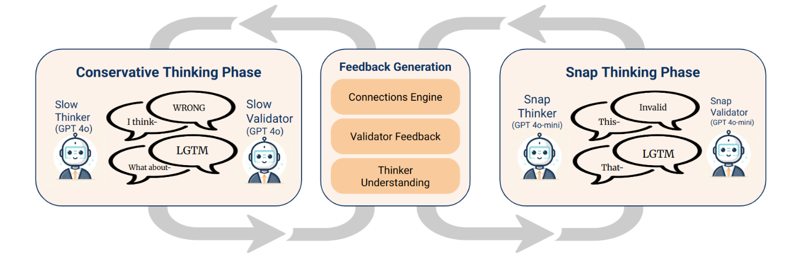

# Making Connections: Multi-Agent LLM Reasoning on NYT Connections

A multi-agent framework that solves NYT Connections puzzles at **98% accuracy on GPT-4o** and **80% on GPT-4o-mini** by detecting and escaping *analysis paralysis* — the failure mode where reasoning models loop on the same wrong answer.

Published at the [1st Workshop for Research on Agent Language Models (REALM 2025)](https://aclanthology.org/2025.realm-1.16/), co-located with ACL 2025.

## Headline results

| Model       | Strategy             | Solve rate | Semantic grounding (↓) | Guesses / puzzle (↓) |
|-------------|----------------------|-----------:|-----------------------:|---------------------:|
| GPT-4o      | Basic prompt         | 58%        | 4.59                   | 10.13                |
| GPT-4o      | Chain-of-Thought     | 72%        | 4.81                   | 8.00                 |
| GPT-4o      | GVC (ours)           | 56%        | 1.50                   | 1.45                 |
| **GPT-4o**  | **Snap-GVC (ours)**  | **98%**    | **0.50**               | **1.38**             |
| GPT-4o-mini | Chain-of-Thought     | 38%        | 3.71                   | 13.70                |
| **GPT-4o-mini** | **Snap-GVC (ours)** | **80%**  | **0.86**               | **2.06**             |

Snap-GVC wins on all three axes: accuracy, semantic grounding (fewer hallucinated out-of-board words), and efficiency (fewer guesses submitted). Notably, Snap-GVC on GPT-4o-mini outperforms every prompting strategy we tested on the 70B-parameter LLaMa-3.3.

Full results table, including all LLaMa variants and baselines, appears in Table 1 of the [paper](https://aclanthology.org/2025.realm-1.16/).

## Idea in one paragraph

LLMs often get stuck in *analysis paralysis* — they deliberate endlessly on the same wrong answer rather than committing or exploring alternatives. **GVC** (Guess, Validate, Consensus) imitates the Rational Speech Act model of pragmatic communication: a Guesser proposes a grouping and a category label, a Validator independently re-derives the grouping from just the label, and a Consensus agent commits only when the two agree. **Snap-GVC** adds a dual-process escape hatch: when the slow, System-2 GVC loop stalls on *k* failures, the system switches to a fast, high-temperature, System-1 Snap-Guesser that breaks the loop through controlled exploration.

## Architecture



*Left: the Slow (System 2) cycle — Guesser and Validator exchange reasoning and feedback. Right: the Snap (System 1) cycle — activated on stagnation, a smaller, higher-temperature model produces intuitive guesses. The Feedback Generation module mediates phase transitions.*

## Installation

```bash
conda create -n connections python=3.12 -y
conda activate connections

git clone https://github.com/Chrislai502/the_amazing_connections.git
cd the_amazing_connections
pip install -e .
```

Set API keys (OpenAI for GPT-4o runs, Groq for LLaMa runs):

```bash
export OPENAI_API_KEY=...
export GROQ_API_KEY=...
```

## Quickstart

Reproduce the headline GPT-4o Snap-GVC result on the first 10 puzzles:

```bash
python src/rsallms/run.py snap_gvc gpt-4o --start 0 --end 10
```

Or via the installed console script:

```bash
run-solver snap_gvc gpt-4o --start 0 --end 10
```

General form:

```bash
python src/rsallms/run.py <solver> <model> --start <i> --end <j>
```

- `<solver>`: `basic`, `cot`, `gvc`, `snap_gvc`
- `<model>`: `gpt-4o`, `gpt-4o-mini`, `llama-3.3-70b-versatile`, `llama-3.1-8b-instant`

Example — Chain-of-Thought with LLaMa-3.3-70b on puzzles 5–20:

```bash
python src/rsallms/run.py cot llama-3.3-70b-versatile --start 5 --end 20
```

## Repository structure

```
src/rsallms/
  agents/            # Guesser, Validator, Consensus, Snap agents
  prompts/           # Mustache templates (see paper Appendix A.4)
  solvers/           # basic, cot, gvc, snap_gvc solver implementations
  eval/              # metrics, aggregation, plotting
  run.py             # CLI entrypoint
display_db_data.py   # Render metrics from evals.db
```

## Citation

If you use this work, please cite:

```bibtex
@inproceedings{pandian-etal-2025-snap,
    title = "Snap Out of It: A Dual-Process Approach to Mitigating Overthinking in Language Model Reasoning",
    author = "Pandian, Ashish  and
      Lojo, Nelson  and
      Lai, Wei Xun  and
      Lukas, Jackson",
    editor = "Kamalloo, Ehsan  and
      Gontier, Nicolas  and
      Lu, Xing Han  and
      Dziri, Nouha  and
      Murty, Shikhar  and
      Lacoste, Alexandre",
    booktitle = "Proceedings of the 1st Workshop for Research on Agent Language Models (REALM 2025)",
    month = jul,
    year = "2025",
    address = "Vienna, Austria",
    publisher = "Association for Computational Linguistics",
    url = "https://aclanthology.org/2025.realm-1.16/",
    doi = "10.18653/v1/2025.realm-1.16",
    pages = "228--249",
    ISBN = "979-8-89176-264-0"
}
```

> **Naming note.** In the paper these methods are called **TVC** (Think, Validate, Consensus) and **Snap-Think**. The code here uses the equivalent names **GVC** and **Snap-GVC** for historical reasons.

## Contributors

- [Ashish Pandian](https://github.com/ashishp166)
- [Chris (Wei Xun) Lai](https://github.com/Chrislai502)
- [Nelson Lojo](https://github.com/nelson-lojo)
- [Jackson Lukas](https://github.com/jacksonmlukas)

## License

MIT — see [LICENSE](LICENSE).
